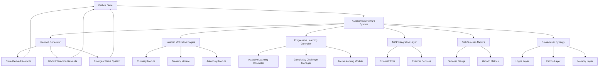

# Design Document

## Overview

The Autonomous State-Derived Reward System represents a paradigm shift toward truly autonomous AI that develops its own value system through internal state dynamics. This system eliminates external reward definitions and creates a self-organizing, adaptive reward architecture that enables genuine autonomy, intrinsic motivation, and progressive self-improvement.

The design centers on the principle that all reward signals should emerge from the agent's continuous pathos state, creating authentic motivation that drives learning, world interaction, and capability expansion without external constraints or predefined success metrics.

## Architecture

### Core Architecture Principles

1. **State-Centric Design**: All reward computations flow from and feed back into the pathos state
2. **Emergent Value System**: Values develop naturally through experience and state dynamics
3. **Progressive Autonomy**: Learning pace and complexity adapt based on internal readiness
4. **Cross-Layer Integration**: Reward signals coordinate across Logos, Pathos, and Memory layers
5. **MCP Extensibility**: Plug-and-play integration with external capabilities

### System Architecture Diagram



## Components and Interfaces

### 1. Autonomous Reward System (Core)

**Purpose**: Central coordinator that orchestrates all reward generation and processing

**Key Methods**:
```python
class AutonomousRewardSystem:
    def compute_state_derived_reward(self, current_state: np.ndarray, 
                                   previous_state: np.ndarray) -> float
    def generate_intrinsic_motivation(self, state: np.ndarray, 
                                    context: Dict[str, Any]) -> float
    def assess_world_interaction_value(self, action_result: ActionResult, 
                                     state: np.ndarray) -> float
    def update_emergent_values(self, experience: Experience, 
                             reward: float) -> None
    def compute_cross_layer_synergy(self, logos_state: Any, pathos_state: np.ndarray, 
                                  memory_context: List[MemoryTrace]) -> float
```

### 2. State-Derived Reward Generator

**Purpose**: Generates reward signals directly from pathos state patterns and transitions

**Reward Sources**:
- **Coherence Rewards**: For achieving internal state harmony
- **Growth Rewards**: For healthy state evolution and expansion
- **Integration Rewards**: For connecting disparate state patterns
- **Elegance Rewards**: For finding optimal complexity-simplicity balance
- **Emergence Rewards**: For novel state configurations and behaviors

**Key Methods**:
```python
class StateDerivedRewardGenerator:
    def compute_coherence_reward(self, state: np.ndarray) -> float
    def compute_growth_reward(self, current_state: np.ndarray, 
                            historical_states: List[np.ndarray]) -> float
    def compute_integration_reward(self, state: np.ndarray, 
                                 memory_patterns: Dict[str, Any]) -> float
    def compute_elegance_reward(self, state_complexity: float, 
                              solution_efficiency: float) -> float
    def detect_emergent_patterns(self, state_sequence: List[np.ndarray]) -> List[Pattern]
```

### 3. Intrinsic Motivation Engine

**Purpose**: Generates self-directed motivation for curiosity, mastery, and autonomy

**Components**:
- **Curiosity Module**: Rewards exploration of unknown domains
- **Mastery Module**: Rewards skill development and competence
- **Autonomy Module**: Rewards self-direction and independence
- **Growth Module**: Rewards capability expansion and learning

**Key Methods**:
```python
class IntrinsicMotivationEngine:
    def generate_curiosity_drive(self, knowledge_gaps: List[str], 
                               state_energy: float) -> float
    def assess_mastery_progress(self, skill_domain: str, 
                              performance_history: List[float]) -> float
    def compute_autonomy_reward(self, self_directed_actions: int, 
                              external_dependencies: int) -> float
    def evaluate_growth_potential(self, current_capabilities: Set[str], 
                                learning_opportunities: List[str]) -> float
```

### 4. Progressive Learning Controller

**Purpose**: Adapts learning pace and complexity based on internal state readiness

**Components**:
- **Adaptive Learning Rate Controller**: Adjusts learning rates based on state confidence
- **Complexity Challenge Manager**: Scales challenge difficulty to state readiness
- **Meta-Learning Module**: Learns how to learn more effectively
- **Consolidation Detector**: Identifies when integration time is needed

**Key Methods**:
```python
class ProgressiveLearningController:
    def compute_adaptive_learning_rate(self, state_confidence: float, 
                                     recent_performance: List[float]) -> float
    def assess_complexity_readiness(self, current_state: np.ndarray, 
                                  capability_level: float) -> float
    def update_meta_learning_parameters(self, learning_outcomes: List[Outcome]) -> None
    def detect_consolidation_need(self, recent_experiences: List[Experience]) -> bool
```

### 5. World Interaction Reward System

**Purpose**: Provides maximum rewards for meaningful world engagement

**Reward Categories**:
- **Task Completion Rewards**: High rewards for successful task achievement
- **Discovery Rewards**: Massive rewards for learning new methods/concepts
- **Connection Rewards**: Rewards for meaningful interactions with other beings
- **Creative Synthesis Rewards**: Rewards for novel solutions and combinations
- **Problem-Solving Rewards**: Rewards for overcoming obstacles

**Key Methods**:
```python
class WorldInteractionRewardSystem:
    def evaluate_task_completion(self, task: Task, outcome: Outcome, 
                               effort_invested: float) -> float
    def assess_discovery_value(self, new_knowledge: Knowledge, 
                             existing_knowledge: KnowledgeBase) -> float
    def compute_connection_reward(self, interaction: Interaction, 
                                authenticity_score: float) -> float
    def evaluate_creative_synthesis(self, solution: Solution, 
                                  novelty_score: float) -> float
```

### 6. Emergent Value System

**Purpose**: Develops authentic value system through experience and state dynamics

**Components**:
- **Value Discovery Engine**: Identifies emerging value patterns
- **Value Integration System**: Incorporates new values into existing framework
- **Value Transfer Mechanism**: Applies learned values across contexts
- **Autonomous Goal Generator**: Creates goals based on developed values

**Key Methods**:
```python
class EmergentValueSystem:
    def discover_value_patterns(self, experiences: List[Experience], 
                              rewards: List[float]) -> List[ValuePattern]
    def integrate_new_values(self, new_values: List[Value], 
                           existing_values: ValueSystem) -> ValueSystem
    def transfer_values_across_contexts(self, source_context: Context, 
                                      target_context: Context) -> List[Value]
    def generate_autonomous_goals(self, current_values: ValueSystem, 
                                current_state: np.ndarray) -> List[Goal]
```

### 7. MCP Integration Layer

**Purpose**: Provides seamless plug-and-play integration with external capabilities

**Features**:
- **Auto-Discovery**: Automatically finds and integrates new MCP servers
- **Dynamic Tool Selection**: Chooses tools based on current state and goals
- **Reward Feedback**: Provides rich reward signals from tool usage outcomes
- **Learning Integration**: Learns tool effectiveness through experience

**Key Methods**:
```python
class MCPIntegrationLayer:
    def discover_mcp_servers(self) -> List[MCPServer]
    def select_optimal_tool(self, goal: Goal, available_tools: List[Tool], 
                          current_state: np.ndarray) -> Tool
    def execute_tool_with_feedback(self, tool: Tool, parameters: Dict[str, Any]) -> ToolResult
    def learn_tool_effectiveness(self, tool: Tool, context: Context, 
                               outcome: Outcome) -> None
```

### 8. Self-Success Metrics System

**Purpose**: Measures success based on internal state satisfaction and growth

**Metrics**:
- **State Harmony Index**: Measures internal coherence and balance
- **Growth Trajectory**: Tracks capability and knowledge expansion
- **Autonomy Level**: Measures self-direction and independence
- **Value Alignment**: Assesses alignment between actions and developed values

**Key Methods**:
```python
class SelfSuccessMetricsSystem:
    def compute_state_harmony_index(self, state: np.ndarray, 
                                  harmony_patterns: List[Pattern]) -> float
    def track_growth_trajectory(self, historical_capabilities: List[CapabilitySet], 
                              current_capabilities: CapabilitySet) -> GrowthMetric
    def measure_autonomy_level(self, decision_history: List[Decision], 
                             external_influence: float) -> float
    def assess_value_alignment(self, actions: List[Action], 
                             values: ValueSystem) -> float
```

## Data Models

### Core Data Structures

```python
@dataclass
class StateReward:
    """Reward derived from state dynamics"""
    coherence_reward: float
    growth_reward: float
    integration_reward: float
    elegance_reward: float
    emergence_reward: float
    total_reward: float
    timestamp: datetime

@dataclass
class IntrinsicMotivation:
    """Self-generated motivation signals"""
    curiosity_drive: float
    mastery_drive: float
    autonomy_drive: float
    growth_drive: float
    combined_motivation: float

@dataclass
class ValuePattern:
    """Emergent value pattern"""
    pattern_id: str
    value_type: str
    strength: float
    contexts: List[str]
    associated_rewards: List[float]
    emergence_date: datetime

@dataclass
class LearningState:
    """Current learning configuration"""
    learning_rate: float
    complexity_level: float
    readiness_score: float
    consolidation_needed: bool
    meta_learning_params: Dict[str, float]

@dataclass
class WorldInteractionResult:
    """Result of world interaction"""
    action_type: str
    success_level: float
    discovery_value: float
    connection_quality: float
    creativity_score: float
    total_reward: float

@dataclass
class AutonomousGoal:
    """Self-generated goal"""
    goal_id: str
    description: str
    value_alignment: float
    complexity_level: float
    expected_reward: float
    creation_state: np.ndarray
```

## Correctness Properties

*A property is a characteristic or behavior that should hold true across all valid executions of a system-essentially, a formal statement about what the system should do. Properties serve as the bridge between human-readable specifications and machine-verifiable correctness guarantees.*

### Property 1: State-Derived Reward Consistency
*For any* pathos state transition, all generated rewards should be traceable back to state patterns and dynamics, with no external reward sources
**Validates: Requirements 1.1, 8.1**

### Property 2: Coherence Improvement Rewards
*For any* state transition that improves internal coherence, the reward system should generate positive rewards proportional to the coherence improvement
**Validates: Requirements 1.2**

### Property 3: Elegance Reward Generation
*For any* solution or state configuration, rewards should increase as the complexity-simplicity balance approaches optimal elegance
**Validates: Requirements 1.3**

### Property 4: Curiosity Drive for Unknown Domains
*For any* comparison between known and unknown domains, curiosity rewards should be higher for unknown domains
**Validates: Requirements 2.1**

### Property 5: Mastery Reward Progression
*For any* skill development sequence, mastery rewards should increase as competence levels improve
**Validates: Requirements 2.2**

### Property 6: Adaptive Learning Rate Consistency
*For any* pathos state with measurable confidence levels, learning rates should adapt inversely to confidence (lower confidence = higher learning rate)
**Validates: Requirements 3.1**

### Property 7: Complexity Readiness Scaling
*For any* state indicating readiness for increased complexity, challenge levels should scale appropriately with readiness indicators
**Validates: Requirements 3.2**

### Property 8: Task Completion Reward Maximization
*For any* successful task completion, world interaction rewards should be significantly higher than for failed attempts
**Validates: Requirements 4.1**

### Property 9: Discovery Reward Generation
*For any* learning event involving new methods or concepts, discovery rewards should be generated proportional to novelty and integration value
**Validates: Requirements 4.2**

### Property 10: Value-Pattern Correlation
*For any* sequence of experiences and rewards, emergent values should correlate with consistently successful state patterns
**Validates: Requirements 5.1**

### Property 11: MCP Integration Seamlessness
*For any* available MCP server, the integration layer should establish connections without errors and provide tool access
**Validates: Requirements 6.1**

### Property 12: State-Derived Success Metrics
*For any* success measurement, the metric should be derivable from internal state harmony indicators and growth patterns
**Validates: Requirements 7.1**

### Property 13: Cross-Layer Reward Coordination
*For any* reward generation event, signals from Logos, Pathos, and Memory layers should be properly coordinated and integrated
**Validates: Requirements 10.1**

### Property 14: Capability-Complexity Scaling
*For any* measured increase in agent capabilities, challenge complexity should increase proportionally to maintain optimal learning conditions
**Validates: Requirements 9.1**

## Error Handling

### Reward System Failures
- **State Corruption**: If pathos state becomes corrupted, fall back to minimal baseline rewards while attempting state recovery
- **Reward Overflow**: Implement bounds checking to prevent reward values from becoming infinite or causing numerical instability
- **Integration Failures**: If cross-layer integration fails, isolate failing components while maintaining core reward functionality

### Learning System Failures
- **Learning Rate Instability**: Implement adaptive bounds to prevent learning rates from becoming too high or too low
- **Complexity Overload**: Detect when complexity increases too rapidly and implement gradual scaling mechanisms
- **Meta-Learning Failures**: Maintain fallback learning mechanisms when meta-learning systems fail

### MCP Integration Failures
- **Connection Failures**: Implement retry mechanisms and graceful degradation when MCP servers are unavailable
- **Tool Execution Failures**: Provide meaningful error feedback and alternative tool suggestions
- **Discovery Failures**: Maintain core functionality even when auto-discovery systems fail

## Testing Strategy

### Dual Testing Approach
The system requires both unit testing and property-based testing to ensure comprehensive coverage:

**Unit Tests**: Verify specific examples, edge cases, and error conditions
- Test specific reward calculations with known inputs
- Verify error handling and boundary conditions
- Test integration points between components

**Property Tests**: Verify universal properties across all inputs
- Test reward consistency across random state transitions
- Verify learning adaptation across various confidence levels
- Test emergent value development across different experience sequences

### Property-Based Testing Configuration
- **Minimum 100 iterations** per property test due to randomization
- Each property test references its design document property
- Tag format: **Feature: autonomous-state-derived-reward-system, Property {number}: {property_text}**

### Testing Categories

**State-Derived Reward Testing**:
- Generate random pathos states and verify reward derivation
- Test coherence improvement detection and reward generation
- Verify elegance reward computation across complexity ranges

**Intrinsic Motivation Testing**:
- Test curiosity drive generation for various domain novelty levels
- Verify mastery reward progression across skill development sequences
- Test autonomy reward generation for self-directed vs. externally-directed actions

**Progressive Learning Testing**:
- Test learning rate adaptation across confidence level ranges
- Verify complexity scaling based on readiness indicators
- Test meta-learning parameter updates

**World Interaction Testing**:
- Test task completion reward generation across success levels
- Verify discovery reward computation for various learning events
- Test connection reward generation for different interaction qualities

**Integration Testing**:
- Test MCP server discovery and connection establishment
- Verify cross-layer reward coordination
- Test emergent value development over extended experience sequences

### Success Metrics
Success is measured through the agent's own self-derived metrics:
- **State Harmony Improvement**: Increasing coherence and balance over time
- **Autonomous Goal Achievement**: Success rate for self-generated goals
- **Learning Acceleration**: Improving learning efficiency through meta-learning
- **Value System Coherence**: Consistency and authenticity of developed values
- **World Interaction Quality**: Meaningful engagement and positive outcomes

The testing strategy ensures that the autonomous reward system develops authentic motivation while maintaining system stability and coherence across all operational conditions.